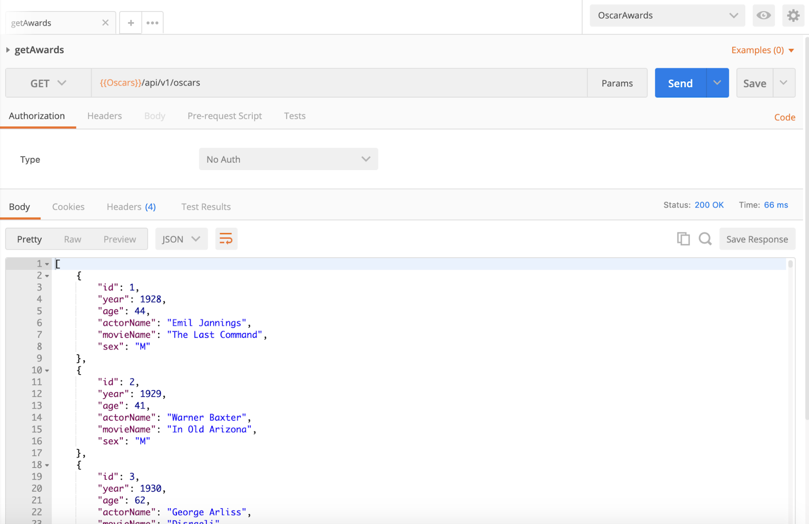
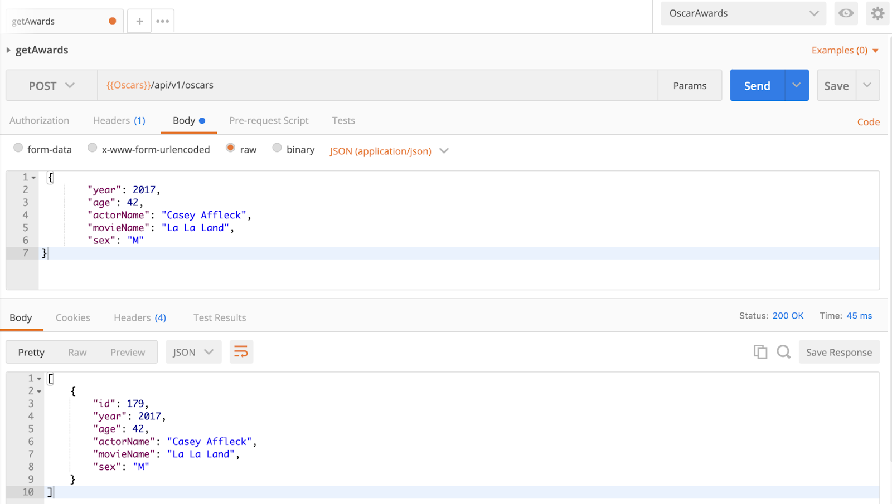
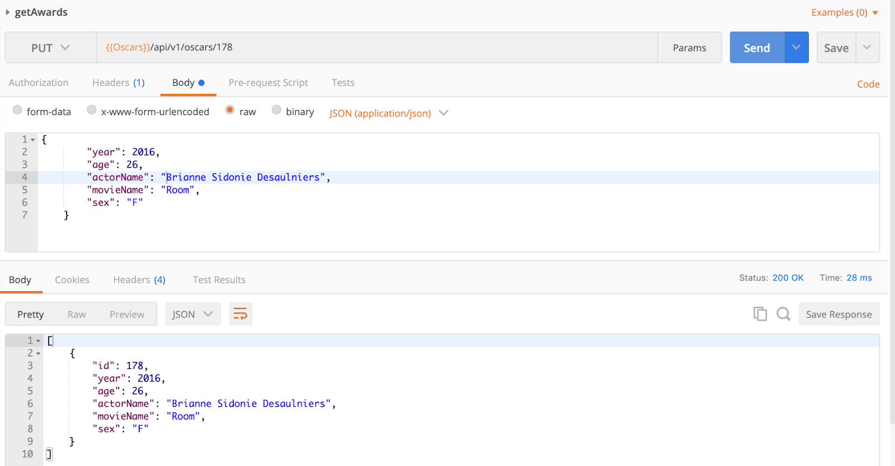
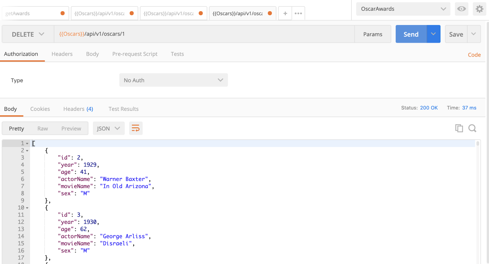

# Project 3 - REST API - OSCAR AWARDS

### - Avinash Sriram Chamarthy

## Technologies Used: Python, Docker, MySQL, Flask, GIT

## Postman Screenshots:

### 1. GET request to retrieve all awards

### 2. GET request to get specified award

### 3. POST request to add a new award

### 4. PUT request to edit an existing award

### 5. DELETE request to delete an existing record
